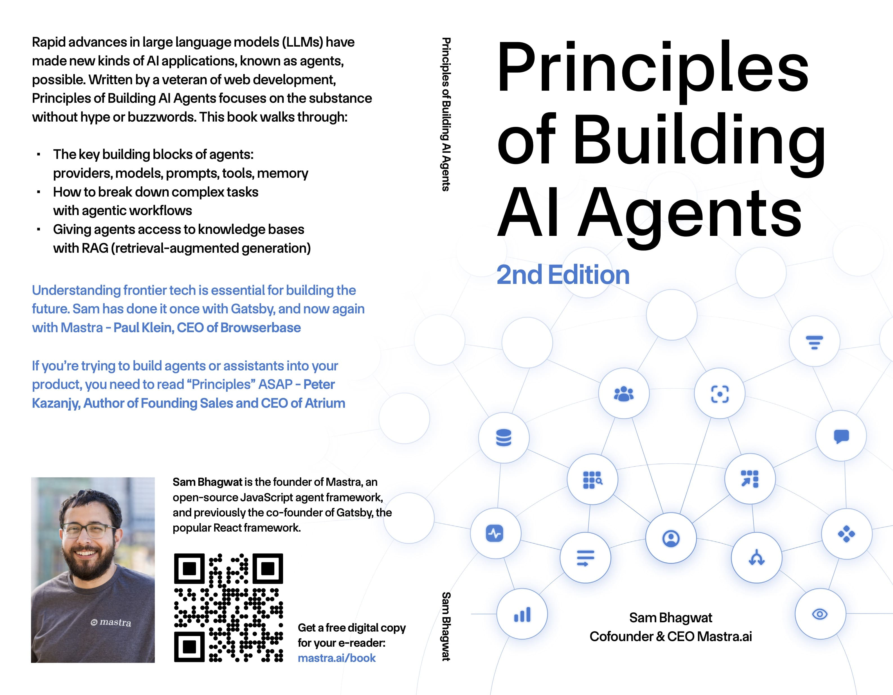

# Principles of Building AI Agents 日本語要約

## 概要

[Mastra社](https://mastra.ai/)が提供する『Principles of Building AI Agents』を、NotebookLMなどを用いて日本語要約しました。

以下より原書をダウンロードし、本要約を理解のサポートとしてお使いください。  
https://mastra.ai/book

## 目次

- [Part 1: 大規模言語モデル（LLM）へのプロンプト入力](01_PROMPTING_A_LARGE_LANGUAGE_MODEL_(LLM).md)
- [Part 2: エージェントの構築](02_BUILDING_AN_AGENT.md)
- [Part 3: ツールとMCP](03_TOOLS_&_MCP.md)
- [Part 4: グラフベースのワークフロー](04_GRAPH-BASED_WORKFLOWS.md)
- [Part 5: 検索拡張生成（RAG）](05_RETRIEVAL-AUGMENTED_GENERATION_(RAG).md)
- [Part 6: マルチエージェントシステム](06_MULTI-AGENT_SYSTEMS.md)
- [Part 7: 評価](07_EVALS.md)
- [Part 8: 開発とデプロイ](08_DEVELOPMENT_&_DEPLOYMENT.md)
- [Part 9: その他](09_EVERYTHING_ELSE.md)

## ライセンス

本要約は学習・参考目的で作成されたものです。原著の著作権はMastra社に帰属します。
